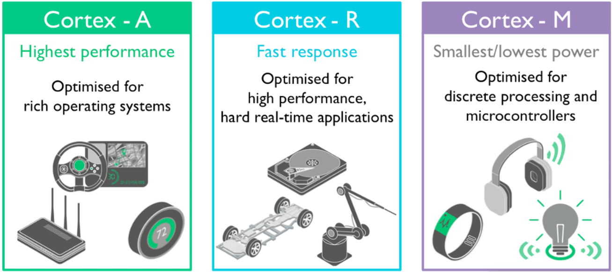

# Microcontroladores e Processadores ARM

## Objetivo

Apresentar os conceitos fundamentais sobre arquiteturas ARM, microcontroladores STM32 e terminologias utilizadas no desenvolvimento de sistemas embarcados.

---

# Sumário

- [Arquitetura ARM](#arquitetura-arm)
- [Famílias ARM Cortex](#famílias-arm-cortex)
- [Microcontroladores STM32](#microcontroladores-stm32)
- [Conceitos Fundamentais](#conceitos-fundamentais)
- [HAL e Low Layer](#hal-e-low-layer)
- [Bare Metal](#bare-metal)
- [Linguagens para Sistemas Embarcados](#linguagens-para-sistemas-embarcados)
- [Referências](#referências)

---

# Arquitetura ARM

A ARM é uma arquitetura de processadores baseada no modelo **RISC** (*Reduced Instruction Set Computer*), projetada para oferecer:

- baixo consumo de energia;
- alta eficiência;
- boa capacidade de processamento;
- simplicidade de instruções.

Os microcontroladores STM32 utilizam núcleos ARM Cortex-M, amplamente empregados em sistemas embarcados.

---

# Famílias ARM Cortex

A arquitetura ARM Cortex é dividida em três categorias principais:

| Família | Aplicação |
|---|---|
| Cortex-A | Processadores de alto desempenho |
| Cortex-R | Sistemas críticos em tempo real |
| Cortex-M | Microcontroladores embarcados |

---

## Cortex-A

Os processadores Cortex-A são utilizados em aplicações com sistemas operacionais robustos, como:

- Linux;
- Android;
- Windows Embedded.

### Características

- Alto desempenho;
- Cache avançado;
- MMU (*Memory Management Unit*);
- Suporte a sistemas operacionais complexos.

### Exemplos de uso

- Smartphones;
- Tablets;
- SBCs;
- Sistemas multimídia.

---

## Cortex-R

Os processadores Cortex-R são destinados a aplicações críticas em tempo real.

### Características

- Baixa latência;
- Alta confiabilidade;
- Determinismo temporal;
- Recursos de segurança funcional.

### Exemplos de uso

- Sistemas automotivos;
- HDs e SSDs;
- Controle industrial;
- Sistemas aeronáuticos.

---

## Cortex-M

Os Cortex-M são destinados a microcontroladores embarcados.

### Características

- Baixo consumo;
- Simplicidade;
- Baixo custo;
- Excelente integração com periféricos.

### Exemplos de uso

- IoT;
- Automação;
- Instrumentação;
- Controle de motores;
- Sensores inteligentes.

---

# Microcontroladores STM32

Os STM32 são microcontroladores desenvolvidos pela STMicroelectronics baseados em núcleos ARM Cortex-M.

A família STM32 possui diversas linhas otimizadas para diferentes aplicações:

| Família | Aplicação Principal |
|---|---|
| STM32F | Uso geral e alto desempenho |
| STM32L | Baixo consumo |
| STM32G | Controle analógico e potência |
| STM32H | Alto desempenho |
| STM32WB | Wireless/Bluetooth |
| STM32MP | Microprocessadores |

---

# Conceitos Fundamentais

## Firmware

Firmware é um software embarcado armazenado na memória do dispositivo responsável por controlar o hardware do sistema.

### Exemplos

- Controle de GPIO;
- Leitura de sensores;
- Comunicação serial;
- Controle de motores.

---

## Sistema Embarcado

Um sistema embarcado é um sistema computacional dedicado a uma aplicação específica.

### Características

- Recursos limitados;
- Baixo consumo;
- Operação em tempo real;
- Alta confiabilidade.

---

## Tempo Real

Um sistema de tempo real deve responder dentro de um prazo previamente definido (*deadline*).

### Tipos

| Tipo | Característica |
|---|---|
| Hard Real-Time | Atrasos não são tolerados |
| Soft Real-Time | Pequenos atrasos são aceitáveis |

---

# HAL e Low Layer

A STMicroelectronics fornece bibliotecas para facilitar o desenvolvimento em STM32.

---

## HAL (*Hardware Abstraction Layer*)

O HAL fornece uma camada de abstração de alto nível.

### Vantagens

- Facilidade de uso;
- Código mais portátil;
- Integração com CubeMX/CubeIDE;
- Desenvolvimento rápido.

### Desvantagens

- Maior overhead;
- Menor controle de baixo nível.

---

## LL (*Low Layer*)

As bibliotecas LL fornecem acesso mais direto aos periféricos.

### Vantagens

- Melhor desempenho;
- Menor overhead;
- Maior controle do hardware.

### Desvantagens

- Código mais complexo;
- Menor abstração.

---

# Bare Metal

Programação *Bare Metal* consiste em desenvolver software sem sistema operacional.

O firmware executa diretamente sobre o hardware.

### Características

- Controle total do sistema;
- Baixa latência;
- Menor consumo de memória;
- Código mais determinístico.

### Aplicações

- Sistemas simples;
- Controle de periféricos;
- Aplicações críticas em tempo real.

---

# Linguagens para Sistemas Embarcados

As linguagens mais utilizadas em microcontroladores são:

| Linguagem | Aplicação |
|---|---|
| C | Principal linguagem embarcada |
| C++ | Sistemas embarcados avançados |
| Assembly | Controle de baixo nível |
| Python | Prototipagem e IoT |
| Rust | Segurança e confiabilidade |

> **Nota:** A linguagem C é amplamente utilizada em sistemas embarcados devido ao controle direto de memória e alta eficiência.

---

# Microcontroladores 8-bit vs 32-bit

Os microcontroladores de 32 bits oferecem maior capacidade de processamento e recursos avançados.

| Característica | 8-bit | 32-bit |
|---|---|---|
| Desempenho | Baixo | Alto |
| Memória | Limitada | Maior |
| Clock | Menor | Maior |
| DSP | Limitado | Presente |
| Aplicações | Simples | Complexas |

---

# Observações

> **Importante:** Os STM32 utilizam arquitetura ARM Cortex-M, sendo amplamente empregados em aplicações industriais, automotivas e IoT.

> **Nota:** A escolha entre HAL e LL depende do equilíbrio desejado entre facilidade de desenvolvimento e desempenho.

---

# Referências

## STMicroelectronics

- https://www.st.com/en/microcontrollers-microprocessors/stm32-32-bit-arm-cortex-mcus.html

## Artigos

- https://resources.altium.com/p/8-bit-vs-32-bit-mcu-choosing-right-microcontroller-your-pcb-design

---

# Próximos Módulos

- `02-softwares-recursos.md`
- `04-debug-swd.md`
- `06-clocks.md`
- `07-gpio.md`
- `18-freertos.md`