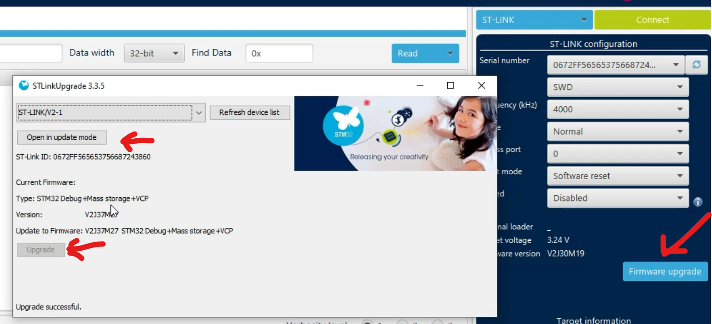

# Softwares e Recursos

## Objetivo

Apresentar as principais ferramentas utilizadas no desenvolvimento com microcontroladores STM32, incluindo IDEs, programadores, servidores de debug, placas de desenvolvimento e documentações técnicas.

---

# Sumário

- [Ferramentas de Desenvolvimento](#ferramentas-de-desenvolvimento)
- [STM32CubeIDE](#stm32cubeide)
- [STM32CubeProgrammer](#stm32cubeprogrammer)
- [ST-LINK](#st-link)
- [Boards Utilizadas](#boards-utilizadas)
- [NUCLEO-L476RG](#nucleo-l476rg)
- [NUCLEO-G474RE](#nucleo-g474re)
- [Documentações Técnicas](#documentações-técnicas)
- [Atualização do ST-LINK](#atualização-do-st-link)
- [Referências](#referências)

---

# Ferramentas de Desenvolvimento

O ecossistema STM32 possui diversas ferramentas oficiais fornecidas pela STMicroelectronics para:

- desenvolvimento;
- configuração;
- gravação;
- depuração;
- monitoramento.

As principais ferramentas utilizadas no curso são:

| Ferramenta | Função |
|---|---|
| STM32CubeIDE | Desenvolvimento e depuração |
| STM32CubeProgrammer | Gravação de firmware |
| ST-LINK | Interface de programação/debug |
| STM32CubeMX | Configuração de periféricos |
| ST-LINK Server | Comunicação remota com debugger |

---

# STM32CubeIDE

O STM32CubeIDE é a IDE oficial da STMicroelectronics para desenvolvimento em STM32.

Ela integra:

- editor de código;
- compilador GCC;
- debugger;
- STM32CubeMX;
- configuração de periféricos.

---

## Principais Recursos

- Configuração gráfica de periféricos;
- Integração com HAL e LL;
- Geração automática de código;
- Debug via SWD/JTAG;
- Monitoramento em tempo real;
- Integração com FreeRTOS.

---

## Fluxo Básico de Desenvolvimento

1. Criar projeto;
2. Selecionar a board ou MCU;
3. Configurar periféricos no CubeMX;
4. Gerar código;
5. Implementar aplicação;
6. Compilar;
7. Gravar;
8. Depurar.

---

## Download

- https://www.st.com/en/development-tools/stm32cubeide.html

---

# STM32CubeProgrammer

O STM32CubeProgrammer é a ferramenta oficial para gravação e gerenciamento de firmware nos dispositivos STM32.

---

## Principais Recursos

- Gravação via ST-LINK;
- Programação via UART;
- Programação via USB;
- Programação via CAN;
- Leitura/escrita de memória;
- Configuração de Option Bytes.

---

## Aplicações

- Upload de firmware `.bin` e `.hex`;
- Recuperação de dispositivos;
- Atualização de bootloader;
- Configuração de memória flash.

---

## Download

- https://www.st.com/en/development-tools/stm32cubeprog.html

---

# ST-LINK

O ST-LINK é o programador/debugger oficial da STMicroelectronics.

Ele permite:

- gravação do firmware;
- debug em tempo real;
- comunicação SWD/JTAG;
- monitoramento da execução.

---

## Principais Interfaces

| Interface | Aplicação |
|---|---|
| SWD | Debug simplificado |
| JTAG | Debug avançado |
| UART | Comunicação serial |

---

## Modelos

| Modelo | Características |
|---|---|
| ST-LINK/V2 | Modelo tradicional |
| STLINK-V3 | Maior desempenho e recursos |

---

## Documentação

- https://www.st.com/en/development-tools/st-link-v2.html
- https://www.st.com/en/development-tools/stlink-v3set.html

---

# ST-LINK Server

O ST-LINK Server permite comunicação remota entre ferramentas de desenvolvimento e dispositivos STM32.

---

## Aplicações

- Debug remoto;
- Programação remota;
- Compartilhamento de hardware em rede.

---

## Download

- https://www.st.com/en/development-tools/st-link-server.html

---

# STM32CubeMX

O STM32CubeMX é uma ferramenta gráfica utilizada para configuração de periféricos e geração automática de código.

Atualmente ele já está integrado ao STM32CubeIDE.

---

## Principais Recursos

- Configuração de clocks;
- Configuração de GPIO;
- Configuração de periféricos;
- Geração de inicialização HAL;
- Configuração de middleware.

---

## Vantagens

- Redução de tempo de desenvolvimento;
- Menor chance de erros de configuração;
- Visualização gráfica da pinagem.

---

# Boards Utilizadas

Durante o curso são utilizadas principalmente as placas da família STM32 NUCLEO.

As placas NUCLEO possuem:

- programador ST-LINK integrado;
- headers compatíveis com Arduino;
- acesso facilitado aos periféricos;
- excelente documentação.

---

# NUCLEO-L476RG

Board baseada no microcontrolador STM32L476RG.

---

## Características

| Recurso | Descrição |
|---|---|
| Núcleo | ARM Cortex-M4 |
| Clock Máximo | 80 MHz |
| Memória Flash | 1 MB |
| SRAM | 128 KB |
| Aplicação | Baixo consumo |

---

## Documentação

- Página oficial:
  - https://www.st.com/en/evaluation-tools/nucleo-l476rg.html

- Datasheet:
  - https://www.st.com/resource/en/datasheet/stm32l476je.pdf

- Reference Manual:
  - https://www.st.com/resource/en/reference_manual/rm0351-stm32l47xxx-stm32l48xxx-stm32l49xxx-and-stm32l4axxx-advanced-armbased-32bit-mcus-stmicroelectronics.pdf

- Schematic:
  - https://www.st.com/resource/en/schematic_pack/mb1136-default-c05_schematic.pdf

---

# NUCLEO-G474RE

Board baseada no microcontrolador STM32G474RE.

---

## Características

| Recurso | Descrição |
|---|---|
| Núcleo | ARM Cortex-M4 |
| Clock Máximo | 170 MHz |
| Memória Flash | 512 KB |
| SRAM | 128 KB |
| Aplicação | Controle analógico e potência |

---

## Documentação

- Página oficial:
  - https://www.st.com/en/evaluation-tools/nucleo-g474re.html#documentation

- Datasheet:
  - https://www.st.com/en/microcontrollers-microprocessors/stm32g474re.html

- Reference Manual:
  - https://www.st.com/resource/en/reference_manual/rm0440-stm32g4-series-advanced-armbased-32bit-mcus-stmicroelectronics.pdf

- Schematic:
  - https://www.st.com/resource/en/schematic_pack/mb1367-g474re-c05_schematic.pdf

---

# Documentações Técnicas

No desenvolvimento embarcado é fundamental consultar documentações oficiais.

---

## Datasheet

Documento que apresenta:

- características elétricas;
- limites máximos;
- pinagem;
- memória;
- periféricos;
- consumo.

---

## Reference Manual

Documento detalhado contendo:

- registradores;
- arquitetura interna;
- funcionamento dos periféricos;
- mapas de memória;
- clocks;
- interrupções.

> **Importante:** O *Reference Manual* é a principal documentação técnica durante o desenvolvimento.

---

## Application Notes (AN)

As *Application Notes* fornecem:

- exemplos práticos;
- boas práticas;
- recomendações de projeto;
- arquiteturas de referência.

---

## Schematics

Os esquemáticos mostram:

- conexões da placa;
- alimentação;
- ST-LINK;
- circuitos auxiliares;
- pinagem dos periféricos.

---

# Atualização do ST-LINK

É recomendado manter o firmware do ST-LINK atualizado para garantir:

- compatibilidade;
- estabilidade;
- melhor desempenho de debug.

---

## Processo de Atualização

1. Conectar a placa via USB;
2. Abrir o STM32CubeProgrammer;
3. Detectar o ST-LINK;
4. Atualizar firmware disponível.

# Observações

> **Nota:** O STM32CubeIDE só incorpora o STM32CubeMX internamente nas versões 1.19.0 para baixo.

> **Importante:** Consulte sempre o datasheet e o reference manual do microcontrolador utilizado.

> **Nota:** As placas NUCLEO facilitam o desenvolvimento por possuírem ST-LINK integrado.

---

# Referências

## STMicroelectronics

- https://www.st.com/content/st_com/en.html
- https://wiki.st.com/stm32mpu
- https://wiki.st.com/stm32mcu
- https://github.com/STMicroelectronics

---

## Ferramentas

- https://www.st.com/en/development-tools/stm32cubeide.html
- https://www.st.com/en/development-tools/stm32cubeprog.html
- https://www.st.com/en/development-tools/st-link-server.html

