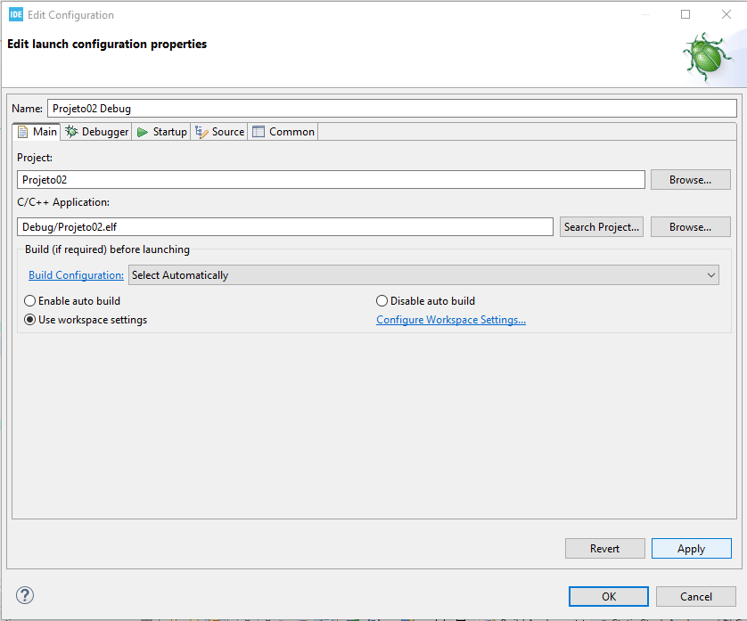
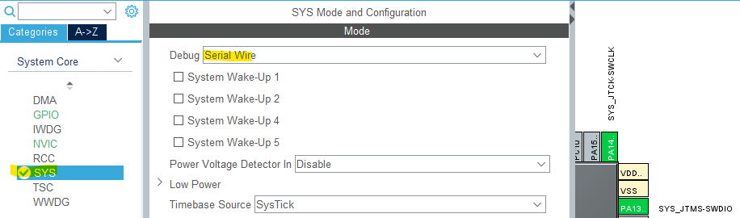
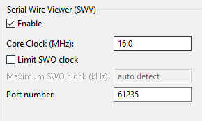
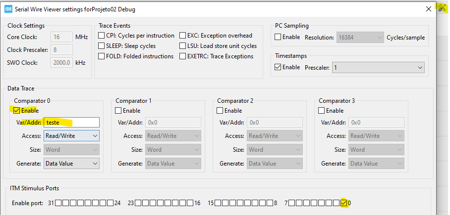

# Ambientes, Projetos e Depurador SWD

## Objetivo

Apresentar o fluxo básico de criação de projetos STM32, compilação, gravação e depuração utilizando STM32CubeIDE, ST-LINK e a interface SWD (*Serial Wire Debug*).

---

# Sumário

- [Introdução](#introdução)
- [Criação de Projetos](#criação-de-projetos)
- [Board Selector](#board-selector)
- [Estrutura de um Projeto STM32](#estrutura-de-um-projeto-stm32)
- [Compilação](#compilação)
- [Debug com SWD](#debug-com-swd)
- [Configuração do Debugger](#configuração-do-debugger)
- [SWV - Serial Wire Viewer](#swv---serial-wire-viewer)
- [Debug em Tempo Real](#debug-em-tempo-real)
- [Boas Práticas](#boas-práticas)
- [Referências](#referências)

---

# Introdução

O processo de desenvolvimento em STM32 normalmente envolve:

1. Criação do projeto;
2. Configuração dos periféricos;
3. Geração de código;
4. Compilação;
5. Gravação do firmware;
6. Depuração (*debug*).

O STM32CubeIDE integra todas essas etapas em uma única ferramenta.

---

# Criação de Projetos

Ao iniciar um novo projeto no STM32CubeIDE é possível selecionar:

- uma board NUCLEO;
- um microcontrolador específico;
- exemplos e templates.

---

# Board Selector

O *Board Selector* facilita a criação de projetos utilizando placas oficiais da ST.

Exemplo utilizado no curso:

- NUCLEO-L476RG

---

## Seleção da Board

Durante a criação do projeto:

1. Clique em `File > New STM32 Project`;
2. Selecione a aba `Board Selector`;
3. Procure pela placa desejada;
4. Selecione a board;
5. Clique em `Next`.

---

# Estrutura de um Projeto STM32

Após a geração do projeto, o STM32CubeIDE cria automaticamente a estrutura básica do firmware.

---

## Principais Diretórios

| Diretório | Função |
|---|---|
| `Core/` | Código principal da aplicação |
| `Drivers/` | HAL, CMSIS e drivers |
| `Debug/` | Arquivos compilados |
| `.ioc` | Configuração CubeMX |

---

## Arquivos Principais

| Arquivo | Função |
|---|---|
| `main.c` | Código principal |
| `stm32xx_it.c` | Rotinas de interrupção |
| `stm32xx_hal_msp.c` | Inicialização de hardware |
| `.ioc` | Configuração gráfica do projeto |

---

# Compilação

A compilação converte o código-fonte em firmware executável para o microcontrolador.

---

## Build do Projeto

No STM32CubeIDE:

```text
Project > Build All
```

---

## Resultado da Compilação

São gerados arquivos como:

| Arquivo | Função |
|---|---|
| `.elf` | Arquivo para debug |
| `.bin` | Firmware binário |
| `.hex` | Firmware hexadecimal |

---

## Console de Build

Após a compilação, o console exibe:

- erros;
- warnings;
- tamanho da memória utilizada;
- status do build.

---

# Debug com SWD

O SWD (*Serial Wire Debug*) é a principal interface de depuração utilizada nos STM32.

---

## Características do SWD

- Utiliza apenas dois sinais;
- Menor quantidade de pinos;
- Alta velocidade;
- Compatível com ST-LINK.

---

## Principais Sinais

| Sinal | Função |
|---|---|
| SWDIO | Dados |
| SWCLK | Clock |
| GND | Referência |
| NRST | Reset |

---

# Configuração do Debugger

Para iniciar o debug:

```text
Run > Debug As > STM32 Cortex-M C/C++ Application
```

---

## Janela de Configuração

Após iniciar o debug:

1. Clique em `Apply`;
2. Clique em `OK`.

<div align="center">



</div>

---

# Recursos de Debug

Durante o debug é possível:

- executar passo a passo;
- visualizar variáveis;
- inspecionar registradores;
- analisar memória;
- pausar execução;
- utilizar breakpoints.

---

## Breakpoints

Breakpoints interrompem a execução do firmware em linhas específicas.

### Aplicações

- inspeção de variáveis;
- análise de fluxo;
- localização de bugs.

---

# SWV - Serial Wire Viewer

O SWV (*Serial Wire Viewer*) permite monitoramento em tempo real utilizando a interface SWD.

---

## Recursos do SWV

- visualização de variáveis;
- gráficos em tempo real;
- monitoramento de eventos;
- profiling;
- análise temporal.

---

# Configuração do SWV

Em:

```text
Run > Debug Configurations
```

Habilite:

```text
Debugger > Serial Wire Viewer (SWV)
```

<div align="center">



</div>

---

## Habilitando Visualização Gráfica

Após iniciar o debug:

```text
Window > Show View > SWV > SWV Data Trace Timeline Graph
```

---

## Configuração do Trace

Clique em:
```text
Configure Trace
```

E configure conforme o clock utilizado no microcontrolador.

<div align="center">



</div>

<div align="center">



</div>

---

# Debug em Tempo Real

O monitoramento em tempo real é extremamente útil para:

- análise de sensores;
- visualização de sinais;
- depuração de RTOS;
- análise de desempenho.

---

## Evite alterar código gerado automaticamente

No STM32CubeIDE utilize:

```c
/* USER CODE BEGIN */

/* USER CODE END */
```

para preservar o código após regeneração do CubeMX.

---

# Problemas Comuns

---

## ST-LINK não detectado

Possíveis causas:

- driver não instalado;
- firmware desatualizado;
- cabo USB defeituoso.

---

## Erro de conexão SWD

Verifique:

- alimentação da placa;
- conexões SWD;
- configuração do clock.

---

## Código não entra no main()

Possíveis causas:

- configuração incorreta de clock;
- falha de inicialização;
- watchdog resetando.

---

# Observações

> **Importante:** O arquivo `.ioc` contém toda a configuração gráfica do CubeMX.

> **Nota:** O SWD substituiu amplamente o JTAG em aplicações STM32.

> **Importante:** Utilize o SWV para monitoramento em tempo real sem necessidade de UART adicional.

---

# Referências

## STMicroelectronics

- https://www.st.com/en/development-tools/stm32cubeide.html
- https://wiki.st.com/stm32mcu
- https://github.com/STMicroelectronics

---

## Documentações

- https://www.st.com/resource/en/user_manual/dm00629855-stm32cubeide-user-guide-stmicroelectronics.pdf