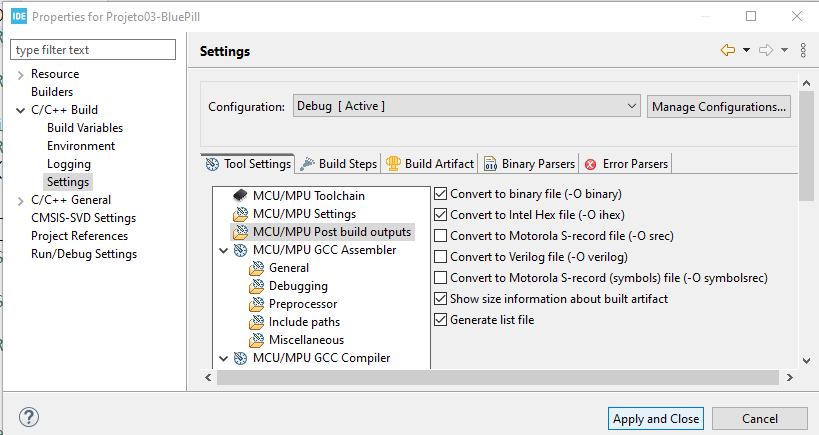
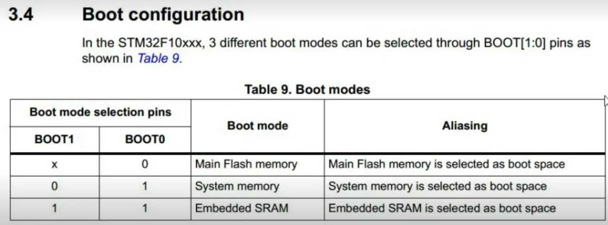
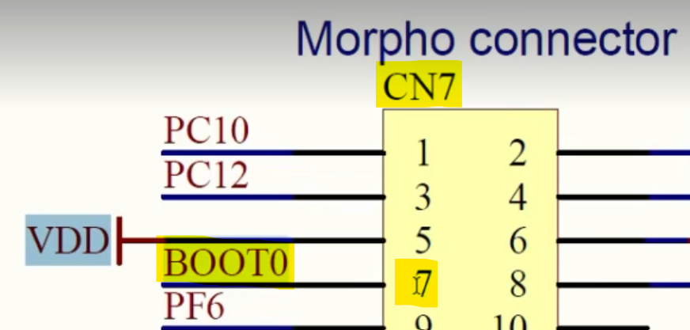
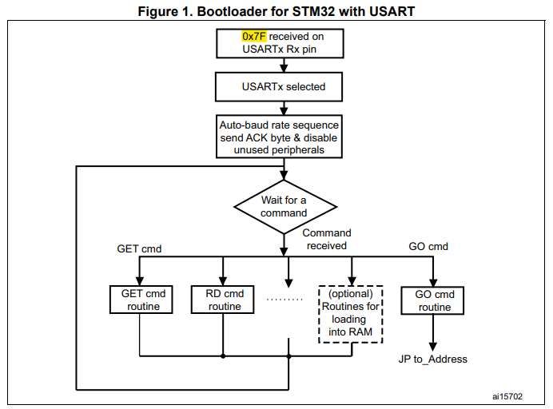
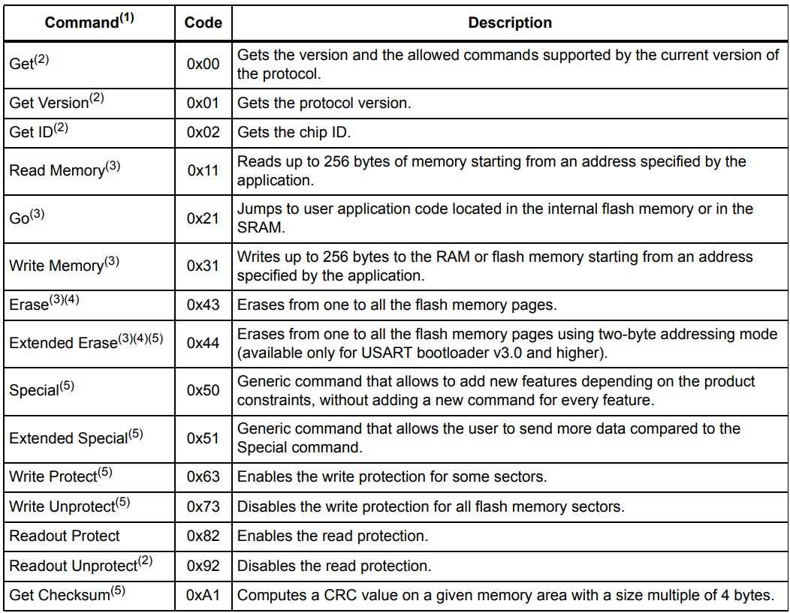

# Gravação, Bootloader e Customização

## Objetivo

Apresentar os conceitos de gravação de firmware, modos de boot dos microcontroladores STM32, uso do bootloader interno e noções básicas de bootloaders customizados.

---

# Sumário

- [Introdução](#introdução)
- [Programação de Firmware](#programação-de-firmware)
- [Arquivos BIN e HEX](#arquivos-bin-e-hex)
- [ST-LINK](#st-link)
- [Modos de Boot](#modos-de-boot)
- [Bootloader Interno STM32](#bootloader-interno-stm32)
- [Programação via UART](#programação-via-uart)
- [Option Bytes](#option-bytes)
- [Bootloader Customizado](#bootloader-customizado)
- [USART Bootloader](#usart-bootloader)
- [Referências](#referências)

---

# Introdução

Os microcontroladores STM32 podem ser programados de diferentes formas:

- ST-LINK;
- UART;
- Bootloader interno;
- Bootloader customizado.

O STM32 já possui um bootloader gravado em memória de fábrica, permitindo gravação sem necessidade de gravador externo.

---

# Programação de Firmware

O firmware pode ser gravado utilizando ferramentas oficiais da STMicroelectronics.

---

## Principais Ferramentas

| Ferramenta | Função |
|---|---|
| STM32CubeProgrammer | Programação oficial |
| FLASHER-STM32 | Programação serial |
| ST-LINK | Debug e gravação |

---

# Arquivos BIN e HEX

Após a compilação do projeto podem ser gerados diferentes formatos de firmware.

| Arquivo | Descrição |
|---|---|
| `.elf` | Debug e símbolos |
| `.bin` | Binário puro |
| `.hex` | Formato Intel HEX |

---

## Habilitando geração BIN e HEX

No STM32CubeIDE:

```text
Project > Properties > C/C++ Build > Settings
```

Habilite as opções de geração dos arquivos:

- `.bin`
- `.hex`

<div align="center">



</div>

---

# ST-LINK

O ST-LINK é a principal interface utilizada para:

- gravação;
- debug;
- monitoramento.

---

## Modelos

| Modelo | Características |
|---|---|
| ST-LINK/V2 | Modelo tradicional |
| STLINK-V3 | Maior velocidade e recursos |

---

## Documentação

- https://www.st.com/en/development-tools/st-link-v2.html
- https://www.st.com/en/development-tools/stlink-v3set.html

---

# Modos de Boot

Os STM32 possuem diferentes modos de inicialização.

O modo selecionado define de onde o microcontrolador irá executar o firmware.

---

## Principais Modos

| Modo | Origem |
|---|---|
| User Flash | Firmware do usuário |
| System Memory | Bootloader interno |
| SRAM | Execução pela RAM |

---

## Seleção do Boot

A seleção normalmente ocorre através do pino:

```text
BOOT0
```

---

## Funcionamento

| BOOT0 | Modo |
|---|---|
| 0 | User Flash |
| 1 | System Memory |

<div align="center">



</div>

---

## Pino BOOT0

Para entrar no bootloader interno:

1. Coloque `BOOT0` em nível alto;
2. Reinicie o microcontrolador.

<div align="center">



</div>

---

# Bootloader Interno STM32

Os STM32 possuem um bootloader gravado de fábrica na região de *System Memory*.

Esse bootloader permite:

- gravação via UART;
- USB;
- CAN;
- SPI;
- I2C.

---

## Documentação

O documento principal é:

- AN2606 — STM32 microcontroller system memory boot mode

---

## Application Note

- https://www.st.com/content/ccc/resource/technical/document/application_note/b9/9b/16/3a/12/1e/40/0c/CD00167594.pdf/files/CD00167594.pdf/jcr:content/translations/en.CD00167594.pdf

---

# Programação via UART

A gravação serial via UART é amplamente utilizada em sistemas embarcados.

---

## Ferramentas

| Ferramenta | Função |
|---|---|
| STM32CubeProgrammer | Programação oficial |
| FLASHER-STM32 | Programação serial |

---

## Software FLASHER-STM32

- https://www.st.com/en/development-tools/flasher-stm32.html

---

## Configuração Básica

| Parâmetro | Valor |
|---|---|
| Baud Rate | 1200 a 115200 |
| Paridade | Even |

---

## Conexão UART

As conexões UART válidas dependem do microcontrolador utilizado.

Consulte:

- tabela 152 da AN2606.

---

# Option Bytes

Os *Option Bytes* são configurações especiais armazenadas na memória do STM32.

Eles controlam:

- proteção de leitura;
- boot;
- watchdog;
- níveis de segurança;
- comportamento do reset.

---

## Cuidados Importantes

Configurações incorretas podem:

- bloquear debug;
- impedir gravação;
- inutilizar parcialmente o dispositivo.

> **Importante:** Sempre revise os Option Bytes antes de gravar.

---

## Documentações

- AN4758
- AN4701

---

## Links

- https://www.st.com/resource/en/application_note/an4758-proprietary-code-readout-protection-on-stm32l4-stm32l4-stm32g4-and-stm32wb-series-mcus-stmicroelectronics.pdf

- https://www.st.com/resource/en/application_note/an4701-proprietary-code-readout-protection-on-microcontrollers-of-the-stm32f4-series-stmicroelectronics.pdf

---

# Bootloader Customizado

Além do bootloader interno, é possível desenvolver um bootloader próprio.

---

## Aplicações

- atualização OTA;
- atualização via Ethernet;
- atualização via CAN;
- atualização via SDCard;
- atualização segura de firmware.

---

## Estrutura Geral

O bootloader normalmente:

1. inicia primeiro;
2. verifica firmware válido;
3. decide se executa atualização;
4. transfere execução para aplicação principal.

---

# USART Bootloader

A ST fornece documentação para implementação do protocolo USART Bootloader.

---

## Documentação

- AN3155 — USART protocol used in the STM32 bootloader

---

## Link

- https://www.st.com/resource/en/application_note/an3155-usart-protocol-used-in-the-stm32-bootloader-stmicroelectronics.pdf

---

## Fluxo de Comunicação

<div align="center">



</div>

---

## Comandos USART Bootloader

<div align="center">



</div>

---

## Software Terminal Serial

| Software | Aplicação |
|---|---|
| Termite | Terminal serial |
| PuTTY | Terminal serial |
| Tera Term | Terminal serial |

---

## Termite

- https://www.compuphase.com/software_termite.htm

---

# Memória do STM32

Os STM32 normalmente possuem:

| Região | Função |
|---|---|
| Flash | Firmware |
| SRAM | Variáveis |
| System Memory | Bootloader interno |
| Option Bytes | Configurações especiais |

---

## Evite interromper gravações

Interrupções durante programação podem corromper a memória flash.

---

# Problemas Comuns

## MCU não entra no bootloader

Verifique:

- estado do BOOT0;
- reset do microcontrolador;
- conexões UART.

---

## Falha de gravação

Possíveis causas:

- baud rate incorreto;
- paridade incorreta;
- firmware incompatível.

---

## Perda de debug

Frequentemente causada por:

- configuração incorreta dos Option Bytes;
- desativação do SWD.

---

# Observações

> **Importante:** O bootloader interno STM32 já vem gravado de fábrica.

> **Nota:** O pino BOOT0 define o modo inicial de execução.

> **Importante:** Alterações incorretas nos Option Bytes podem bloquear o dispositivo.

---

# Referências

## STMicroelectronics

- https://www.st.com/en/development-tools/stm32cubeprog.html
- https://www.st.com/en/development-tools/flasher-stm32.html

---

## Application Notes

- AN2606
- AN3155
- AN4701
- AN4758

---

## Ferramentas

- https://www.compuphase.com/software_termite.htm

---

## Hardware

- https://www.mikroe.com/clicker-stm32f4