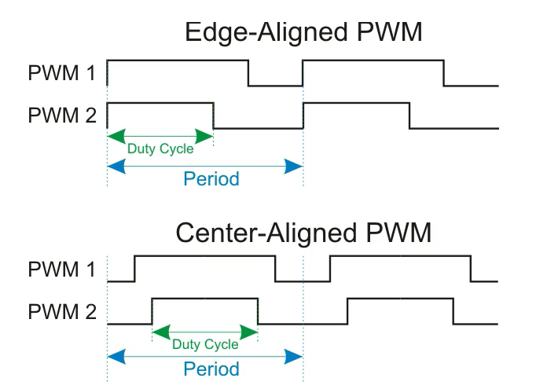

# PWM, Output Compare e Input Capture no STM32

## Objetivo

Apresentar os conceitos fundamentais e as aplicações práticas de **Modulação por Largura de Pulso (PWM)**, **Output Compare (OC)** e **Input Capture (IC)**, utilizando os timers dos microcontroladores STM32, com foco nas resoluções e recursos avançados das placas **NUCLEO-G474RE** e **NUCLEO-L476RG**.

---

# Sumário

- [Introdução](#introdução)
- [PWM - Pulse Width Modulation](#pwm---pulse-width-modulation)
- [Cálculos de Frequência e Duty Cycle](#cálculos-de-frequência-e-duty-cycle)
- [Modos de Alinhamento (Edge vs. Center)](#modos-de-alinhamento-edge-vs-center)
- [Output Compare (OC)](#output-compare-oc)
- [Input Capture (IC)](#input-capture-ic)
- [Recursos Avançados: Dead-Time e HRTIM](#recursos-avançados-dead-time-e-hrtim)
- [Controle via Biblioteca HAL](#controle-via-biblioteca-hal)
- [Referências](#referências)

---

# Introdução

Os timers do STM32 são periféricos versáteis que operam de forma independente da CPU, permitindo a geração e medição de sinais temporizados com extrema precisão. Eles são divididos em categorias como **Controle Avançado**, **Uso Geral** e **Básicos** .

# PWM - Pulse Width Modulation

O modo PWM permite gerar um sinal digital com **frequência estável** e **largura de pulso variável**. É amplamente utilizado para controle de potência em motores, brilho de LEDs e em conversores DC-DC.

### Duty Cycle
O **Duty Cycle** (Ciclo de Trabalho) define a fração do período em que o sinal permanece em nível lógico alto. No STM32, ele é controlado pelo registrador **CCR** (*Capture/Compare Register*).
*   **0% de Duty Cycle:** CCR = 0.
*   **100% de Duty Cycle:** CCR > ARR.

# Cálculos de Frequência e Duty Cycle

A configuração do sinal PWM depende de três registradores principais: **PSC** (Prescaler), **ARR** (Auto-reload) e **CCR**.

1.  **Frequência do PWM ($f_{PWM}$):**
    $$f_{PWM} = \frac{f_{TIM\_CLK}}{(PSC + 1) \times (ARR + 1)}$$
2.  **Resolução do Duty Cycle:** Definida pelo valor de ARR. Um ARR maior permite um ajuste mais fino do ciclo de trabalho.

# Modos de Alinhamento (Edge vs. Center)

*   **Edge-Aligned (Alinhado pela borda):** O contador conta de 0 até o valor ARR. O sinal muda de estado quando o contador atinge o valor CCR.
*   **Center-Aligned (Alinhado pelo centro):** O contador conta de 0 até ARR e depois de ARR até 0. Isso gera um PWM simétrico, ideal para controle de motores, pois reduz harmônicos e ruído eletromagnético.

  

# Output Compare (OC)

O modo **Output Compare** é usado para controlar uma forma de onda de saída ou indicar quando um período de tempo específico expirou.
*   Quando ocorre uma coincidência entre o contador (**CNT**) e o registrador **CCR**, a saída pode ser configurada para: **Ficar ativa**, **Ficar inativa**, **Inverter o estado (Toggle)** ou **Permanecer inalterada**.
*   É a base para a geração de pulsos únicos (**One-Pulse Mode**).

# Input Capture (IC)

O modo **Input Capture** é utilizado para medir a frequência, o período ou a largura de pulso de um sinal externo.
*   O timer captura o valor atual do contador (**CNT**) e o armazena no registrador **CCR** assim que uma transição (borda de subida ou descida) é detectada no pino de entrada.
*   **Aplicações:** Medição de velocidade de motores (sensores de efeito Hall) e decodificação de sinais de rádio controle.

# Recursos Avançados: Dead-Time e HRTIM

*   **Dead-Time (Tempo Morto):** Presente nos timers de controle avançado, o Dead-Time insere um atraso entre o desligamento de um sinal e o acionamento de seu complementar. Isso evita curtos-circuitos em pontes H (shoot-through).

    *   **Objetivo:** Evitar o curto-circuito (*shoot-through*), garantindo que um interruptor de potência esteja completamente desligado antes que o outro ligue.
    *   **Controle:** É configurado através dos bits **DTG[7:0]** no registrador `TIMx_BDTR`.

    A duração do tempo morto depende de uma hierarquia de clocks baseada no clock interno do timer ($T_{CK\_INT}$):

    - **Clock de Amostragem ($TDTS$):** Definido pelos bits `CKD[1:0]` no registrador `TIMx_CR1`.
        *   `00`: $TDTS = T_{CK\_INT}$
        *   `01`: $TDTS = 2 \times T_{CK\_INT}$
        *   `10`: $TDTS = 4 \times T_{CK\_INT}$
    - **Clock do Dead-Time ($T_{dtg}$):** Derivado de $TDTS$ conforme a faixa de valor definida nos bits superiores de `DTG`.

        | Se DTG[7:5] for... | Faixa de Duração do Dead-Time | Clock de Base ($T_{dtg}$) |
        | :--- | :--- | :--- |
        | `0xx` | $DTG[7:0] \times T_{dtg}$ | $TDTS$ |
        | `10x` | $(64 + DTG[5:0]) \times T_{dtg}$ | $2 \times TDTS$ |
        | `110` | $(32 + DTG[4:0]) \times T_{dtg}$ | $8 \times TDTS$ |
        | `111` | $(32 + DTG[4:0]) \times T_{dtg}$ | $16 \times TDTS$ |

    **Exemplo:**
    *   **Frequência do Timer ($f_{CK\_INT}$):** 50 MHz.
    *   **Período de Oscilação ($T_{CK\_INT}$):** $20\text{ ns}$.
    *   **Dead-time desejado:** $14\text{ }\mu s$ ($14.000\text{ ns}$).
    *   **Configuração de Clock:** Assumindo `CKD[1:0] = 00`, então $TDTS = T_{CK\_INT} = 20\text{ ns}$.

        **Passo 1: Identificar a faixa de clock adequada**
        Precisamos encontrar qual multiplicador de $T_{dtg}$ alcança $14.000\text{ ns}$:
        1.  **Faixa 1 ($T_{dtg} = 20\text{ ns}$):** Máximo $127 \times 20\text{ ns} = 2.540\text{ ns}$ (Insuficiente).
        2.  **Faixa 2 ($T_{dtg} = 40\text{ ns}$):** Máximo $(64+63) \times 40\text{ ns} = 5.080\text{ ns}$ (Insuficiente).
        3.  **Faixa 3 ($T_{dtg} = 160\text{ ns}$):** Máximo $(32+31) \times 160\text{ ns} = 10.080\text{ ns}$ (Insuficiente).
        4.  **Faixa 4 ($T_{dtg} = 320\text{ ns}$):** Máximo $(32+31) \times 320\text{ ns} = 20.160\text{ ns}$ (**Faixa Correta!**).

        **Passo 2: Calcular o valor dos bits de dados**
        Para a Faixa 4, os bits `DTG[7:5]` devem ser `111`. Usamos a fórmula:
        $$\text{Dead-time} = (32 + \text{valor\_bits}) \times T_{dtg}$$
        $$14.000\text{ ns} = (32 + x) \times 320\text{ ns}$$
        $$32 + x = 14.000 / 320 = 43,75$$
        $$x = 11,75 \approx 12 \text{ (arredondando)}$$

        **Passo 3: Montar o registrador DTG[7:0]**
        *   **Bits de Faixa [7:5]:** `111`
        *   **Bits de Valor [4:0]:** `01100` (12 em binário).
        *   **Resultado Final:** DTG = `11101100` (binário) $\rightarrow$ **0xEC** (hexadecimal) $\rightarrow$ **236** (decimal).

*   **HRTIM (Timer de Alta Resolução):** Exclusivo da série STM32G474, oferece uma resolução incrível de **184 ps**. É um builder de formas de onda complexas projetado para fontes chaveadas de alta frequência.

# Controle via Biblioteca HAL

A biblioteca HAL fornece funções específicas para iniciar e parar as funções dos timers:

*   **PWM:** `HAL_TIM_PWM_Start()`, `HAL_TIM_PWM_Stop()`.
*   **Output Compare:** `HAL_TIM_OC_Start()`, `HAL_TIM_OC_Stop()`.
*   **Input Capture:** `HAL_TIM_IC_Start()`, `HAL_TIM_IC_Stop()`.
*   **Modo Interrupção/DMA:** Todas as funções acima possuem variantes `_IT` ou `_DMA` para operar sem sobrecarregar a CPU.

---

# Referências

*   **RM0440:** Manual de Referência - Série STM32G4.
    - Complementary outputs and dead-time insertion - Pg.1189
*   **RM0351:** Manual de Referência - Série STM32L4.
*   **AN4013:** Application note - STM32 cross-series timer overview
    - Complementary signal and dead time feature - Pg.26
*   **UM2570:** Manual do Driver HAL/LL para STM32G4.
*   **Datasheet STM32G474RE / STM32L476RG.**
